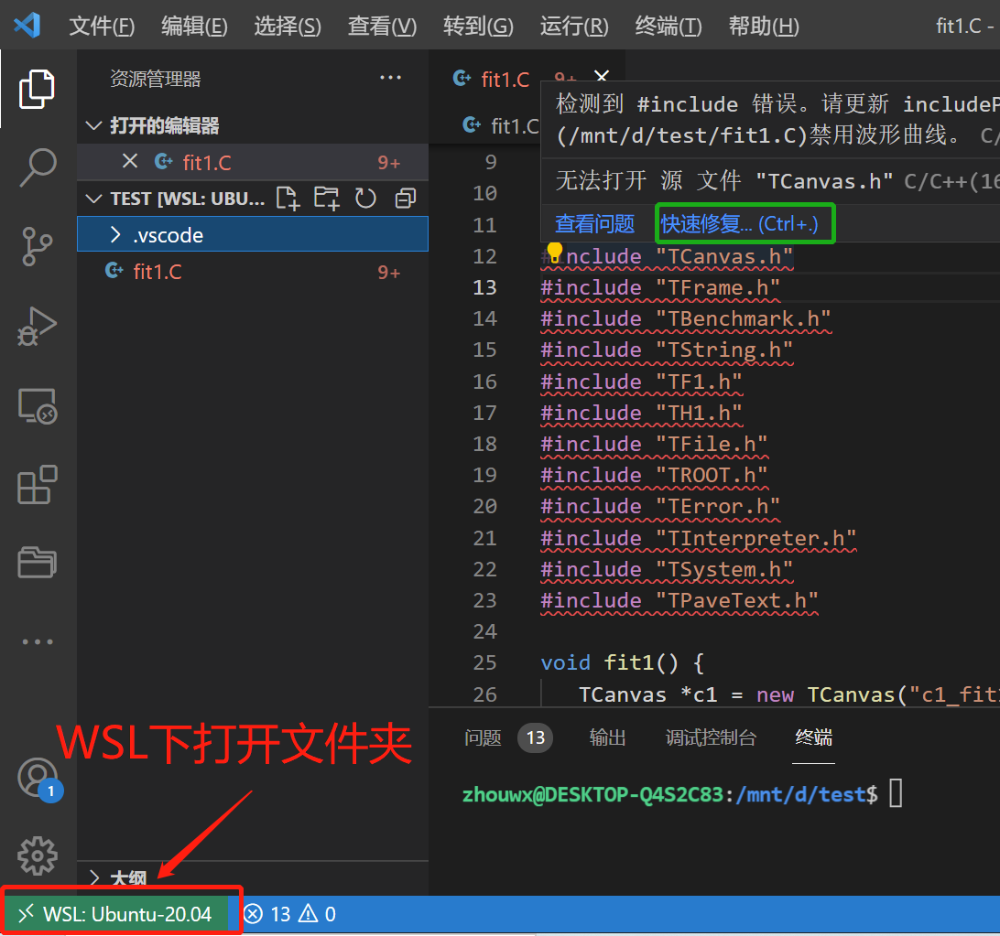

# 使用VS code对ROOT进行调试

[原文参考链接](https://root.cern.ch/blog/root-on-vscode/)

**这一次我们会尝试对ROOT进行断点调试**

在WLS下打开 .C 文件所在的目录：

此时头文件会出现红色下划线提示，鼠标移动到红色下划线处，

出现 **快速修复** ，点击并选择 **编辑"includePath"设置** 

在打开的 **C/C++ Configurations** 中，编辑 **包含路径** 选项

需要添加root所包含的头文件路径

完成以后就可以看到红色下划线消失，并且有函数提示功能：

**注意:可能反应比较慢，需要多等一会**

按下"F5" -> C++(GDB/LLDB) -> 默认配置

 

此时会自动创建文件  **launch.json** ：

需要更改的有：

    "problem":这里要填写root.exe所在的路径,位于root安装路径下的bin文件夹

    "args"：这里需要执行的命令，"-l","-q"不是必须项，也可以没有。.C 文件名必须要有

接着启动调试即可：

