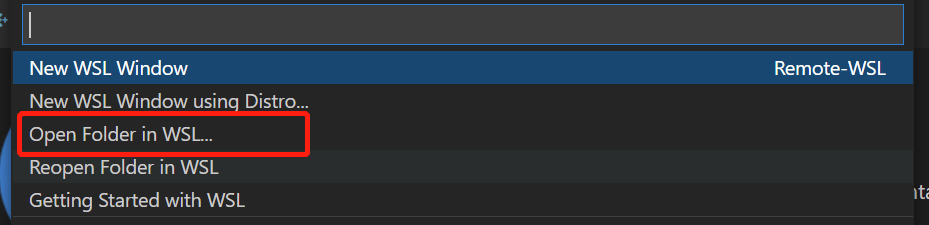
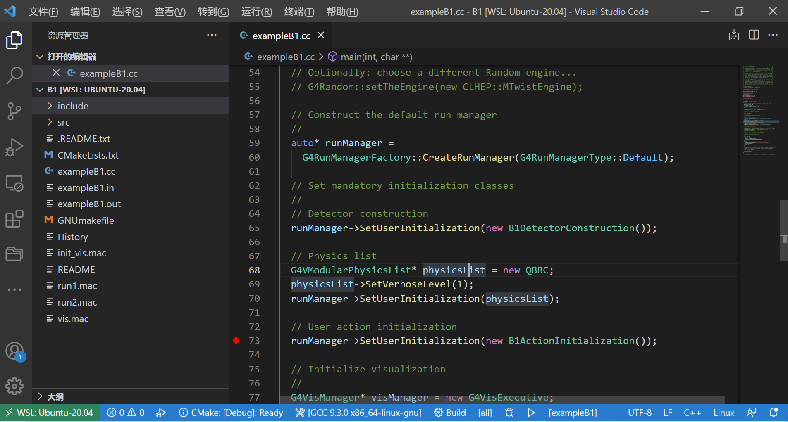
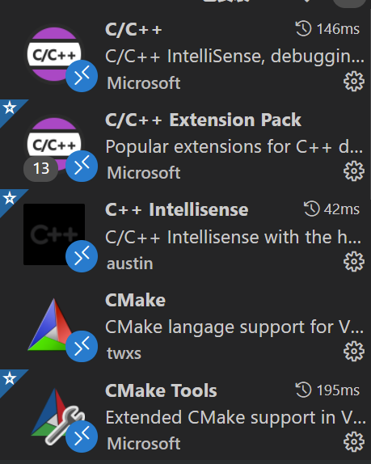
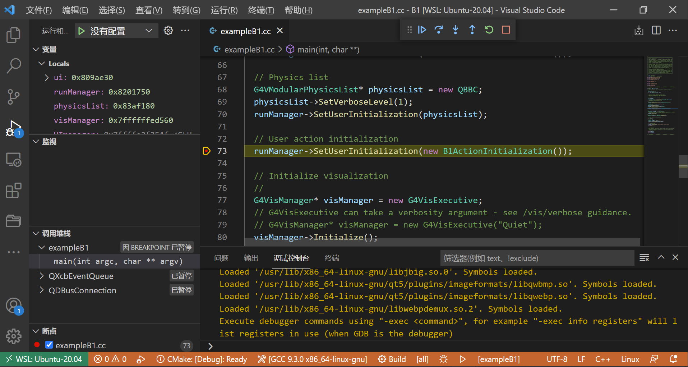

# 使用VS code对geant4进行调试

上一篇中在WSL中成功安装了geant4

[安装链接](https://zhouwx19.github.io/my-site/geant4/%E5%AE%89%E8%A3%85/)

**这一次我们会尝试对geant4进行断点调试**

在VS code中安装插件：

    Remote - WSL

请确保VS code的状态栏是开启状态  开启方法：**查看->外观->显示状态栏**

此时VS code左下角会出现如下图标(打开远程窗口)：

在任一ubuntu终端下，安装调试工具gdb：

    sudo apt-get install gdb

点击，并选择打开geant4主程序所在路径，这里以B1为例：

打开之后：

其中随机添加了一个断点。

在WSL中还要安装以下插件：

直接点击debug按钮：

应该会成功停在断点处：

