# Windows子系统 WSL (Ubuntu) 安装geant4教程

2021-11-06
## 一．在windows电脑安装ubuntu子系统
### 1. 设置windows电脑

(1) 在windows左下角搜索框中输入
``` 
启用或关闭Windows功能
``` 
(2)点击进入  **启用或关闭Windows功能**


(3)选择适用于Linux的Windows子系统

(4)点击确定

(5)重启计算机


### 2. 安装和设置ubuntu
#### 2.1 安装

(1)重启电脑后，进入微软商店`Micrsoft Store`。搜索

    ubuntu


(2)选择Ubuntu20.04 LTS, 然后点击安装


(3)安装完成后点击 `启动`。需要等几分钟初始化，然后按照提示设置用户名与密码即可。
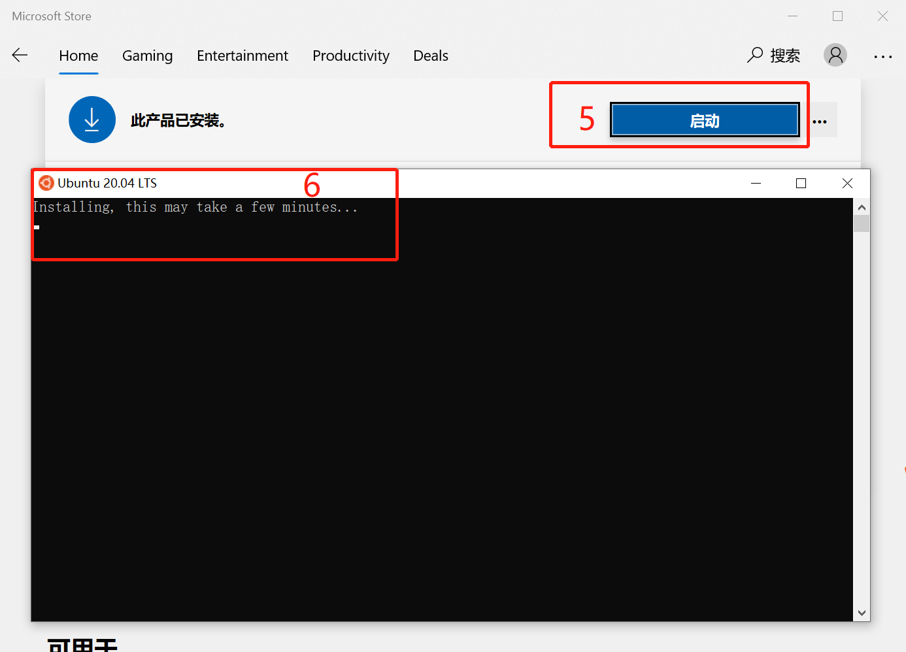


#### 2.2 更换为国内源。

##### 1.打开ubuntu方式有：

(1)在应用栏找到`Ubuntu 20.04 LTS`图标点击

(2)在任一文件路径处，输入`bash`

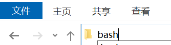

(3)快捷键，依次按下 `Shift`, `鼠标右键`, `L`

##### 2.使用[清华大学开源镜像](https://mirrors.tuna.tsinghua.edu.cn/help/ubuntu/)

打开ubuntu以后，输入命令：

    sudo nano /etc/apt/sources.list

将sources.list文件内容替换如下内容：

```
# 默认注释了源码镜像以提高 apt update 速度，如有需要可自行取消注释
deb http://mirrors.tuna.tsinghua.edu.cn/ubuntu/ focal main restricted universe multiverse
# deb-src https://mirrors.tuna.tsinghua.edu.cn/ubuntu/ focal main restricted universe multiverse
deb http://mirrors.tuna.tsinghua.edu.cn/ubuntu/ focal-updates main restricted universe multiverse
# deb-src https://mirrors.tuna.tsinghua.edu.cn/ubuntu/ focal-updates main restricted universe multiverse
deb http://mirrors.tuna.tsinghua.edu.cn/ubuntu/ focal-backports main restricted universe multiverse
# deb-src https://mirrors.tuna.tsinghua.edu.cn/ubuntu/ focal-backports main restricted universe multiverse
deb http://mirrors.tuna.tsinghua.edu.cn/ubuntu/ focal-security main restricted universe multiverse
# deb-src https://mirrors.tuna.tsinghua.edu.cn/ubuntu/ focal-security main restricted universe multiverse

# 预发布软件源，不建议启用
# deb https://mirrors.tuna.tsinghua.edu.cn/ubuntu/ focal-proposed main restricted universe multiverse
# deb-src https://mirrors.tuna.tsinghua.edu.cn/ubuntu/ focal-proposed main restricted universe multiverse
```

**注意，这里使用http，而非https**

按下`Ctrl+O`和`Enter`保存命令，按下`Ctrl+X`退出编辑

进行更新：

    sudo apt-get update && sudo apt-get upgrade 


## 二．安装geant4

### 1. 安装cmake以及geant4依赖

    sudo apt-get install -y cmake
    sudo apt-get install -y cmake-qt-gui 
    sudo apt-get install -y cmake-curses-gui
    sudo apt-get install -y build-essential
    sudo apt-get install -y libexpat-dev libgl1-mesa-dev libglu1-mesa-dev libxt-dev libxmu-dev libxerces-c-dev libxi-dev zlib1g-dev libgl2ps-dev libexpat1-dev libmotif-dev qt5*

### 2. 下载geant4 [点击下载](https://geant4.web.cern.ch/support/download)

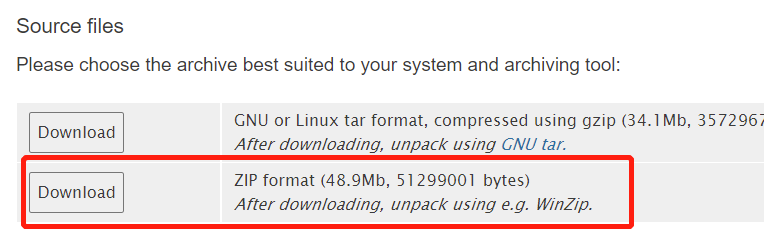

### 3. 下载CLHEP [点击下载](https://proj-clhep.web.cern.ch/proj-clhep/clhep23.html)

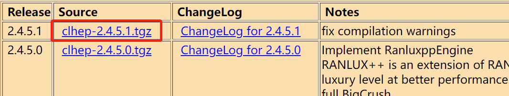

### 4. 安装

在任意盘中，我这里以放在D盘为例：新建文件夹geant4，并将上面下载的安装包解压后放置其中，结构如下：

```
geant4/
├─ CLHEP/
│  └─ 2.4.5.1/
│     └─ CLHEP/
└─ build/
└─ geant4_10_07_p02/
└─ install/
```
其中，需要新建`build` 和 `install` 文件夹。
如果版本发生变化，`geant4_10_07_p02`名字以实际为准

#### 4.1 安装CLHEP

进入到文件夹 `2.4.5.1/`,并在当前文件目录中输入`bash`打开ubuntu。
依次输入：

    mkdir build
    cd build 

此时文件夹结构应该为：
```
geant4/
├─ CLHEP/
│  └─ 2.4.5.1/
│     └─ CLHEP/
│     └─ build/
└─ build/
└─ geant4_10_07_p02/
└─ install/
```
解压方式不同，产生的子文件夹也不同。还请保证以上文件下没有与其同名的文件夹。

ubuntu终端显示如下：

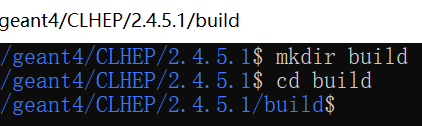

然后依次输入以下命令即可安装成功CLHEP：

```
cmake ../CLHEP                       
make -j8
make install
```
如果在安装过程中出现`Permission denied`,输入 `sudo su` 以便有足够的权限

关闭此ubuntu终端

#### 4.2 安装geant4

进入文件夹`geant4/build/`,在此路径下打开一个新的ubuntu终端。

输入`cmake`命令:

    cmake ../geant4_10_07_p02

使用ccmake 图形化编译

    ccmake .

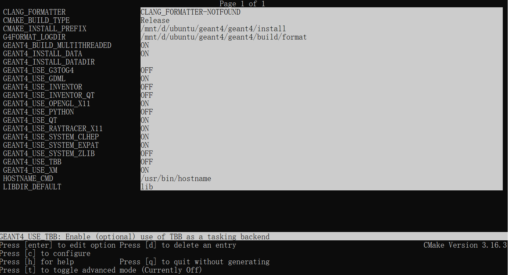

其中 CMAKE_INSTALL_PREFIX一项对应 /geant4/install，后面geant4会安装在这个路径下

不指定datadir路径，11个Data files 会自动下载,

注意：网站上应该有12个Data files，这里缺少文件 G4TENDL1.3.2

也可以提前下载好12个Data files，并指定 GENAT4_INSTALL_DATADIR为存放地址。

按下`c`进行编译，直到出现`g`，按下`g`

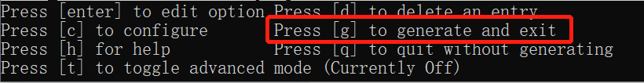

进行编译：

    make -j8

编译时间较长，耐心等待

编译完成后再安装：

    make install

安装完以后，需要把geant4 添加到环境变量：

    sudo nano ~/.bashrc

在文件最后一行加上：

    source /mnt/d/**/geant4/install/bin/geant4.sh

其中`**`需要修改为实际的路径 


按下`Ctrl+O`和`Enter`保存命令，按下`Ctrl+X`退出编辑
#### 4.3 安装 Xming  [点击下载](https://sourceforge.net/projects/xming/files/Xming/6.9.0.31/Xming-6-9-0-31-setup.exe/download)

安装完以后，需要把Xming 添加到环境变量：

    sudo nano ~/.bashrc

最后一行加上：

    export DISPLAY=localhost:0.0

按下`Ctrl+O`和`Enter`保存命令，按下`Ctrl+X`退出编辑

另外，还需要执行：

    sudo apt-get install x11-apps

按下win键，可以看到【最近添加】中有Xming 和XLaunch：


双击Xming，保证Xming出现在右下角隐藏的图标中：

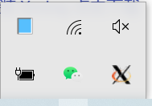

此时在ubuntu终端输入：

    xeyes

如果左上角出现会随鼠标移动而转动的眼睛，表明安装成功

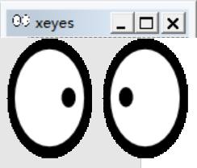

此外如果想调整Xming显示字大小的话，则需要

在【最近添加】中找到Xming,  右键 -> 更多 ->  打开文件位置 
找到Xming的快捷方式然后右键，点击属性

在目标一栏的最后，添加 ` -dpi 108 ` 即可

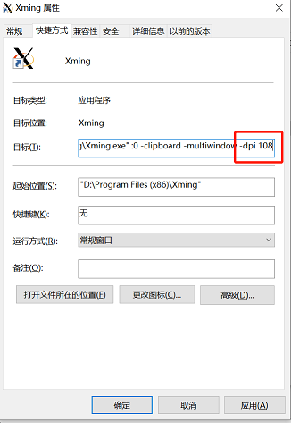


#### 4.4 geant4测试

打开文件夹 geant4_10_07_p02/exapmles/basic/B1

在此路径下打开ubuntu终端

依次输入以下命令：

    mkdir build
    cd build
    cmake ..
    make 
    ./exampleB1


会报错：
```
./exampleB1: error while loading shared libraries: libQt5Core.so.5: cannot open shared object file: No such file or directory
```
需要执行：

    sudo strip --remove-section=.note.ABI-tag /usr/lib/x86_64-linux-gnu/libQt5Core.so.5


然后再

    ./exampleB1


会出现图形界面：

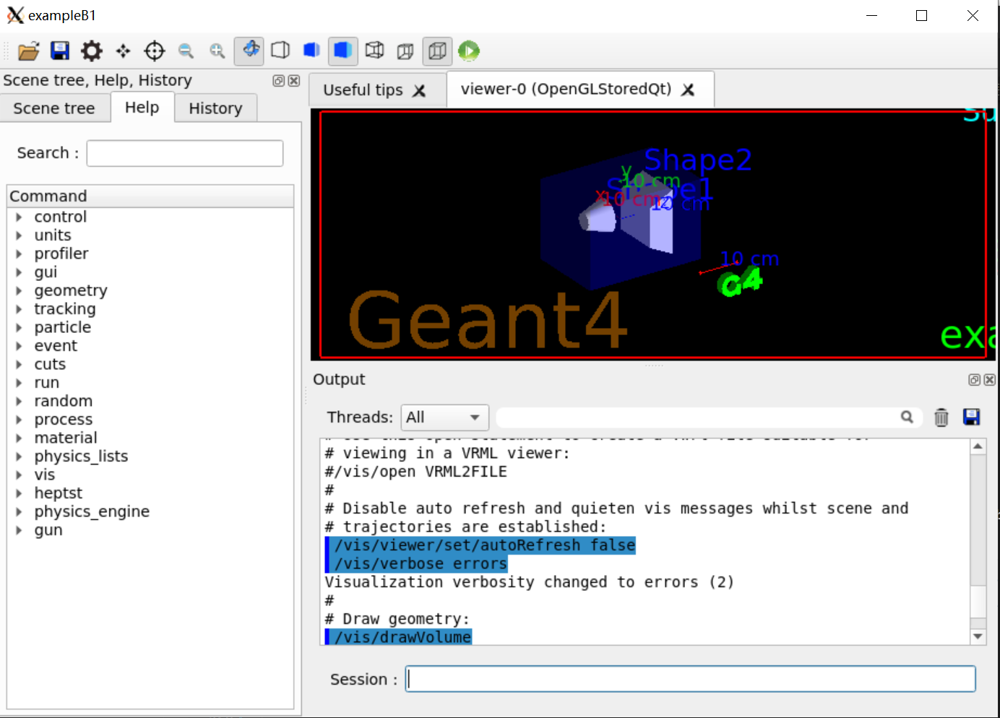

在session中输入:

    /run/beamOn 10 

发射10个粒子


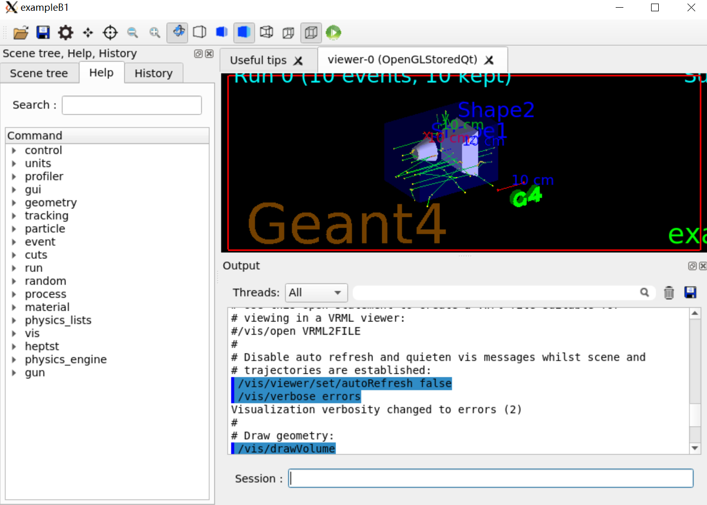


#### 4.5 安装root[点击下载](https://root.cern/install/all_releases/)

安装依赖：

```
sudo apt-get install dpkg-dev cmake g++ gcc binutils libx11-dev libxpm-dev \
libxft-dev libxext-dev python libssl-dev
```

可选安装：
```
sudo apt-get install gfortran libpcre3-dev \
xlibmesa-glu-dev libglew1.5-dev libftgl-dev \
libmysqlclient-dev libfftw3-dev libcfitsio-dev \
graphviz-dev libavahi-compat-libdnssd-dev \
libldap2-dev python-dev libxml2-dev libkrb5-dev \
libgsl0-dev
```

建议选择预编译好的 ubuntn20 版本，好处是添加环境变量即可使用：

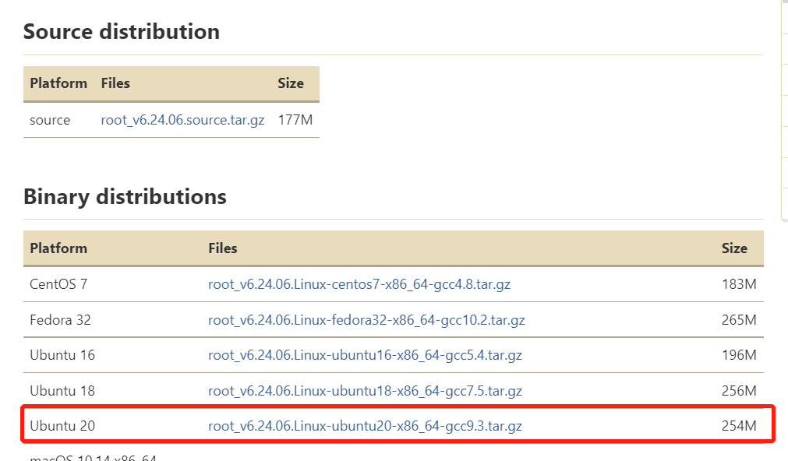

添加环境变量：

    sudo nano ~/.bashrc

最后一行加上：

    source /mnt/d/**/root/bin/thisroot.sh

按下`Ctrl+O`和`Enter`保存命令，按下`Ctrl+X`退出编辑

直接执行命令`root`即可使用root

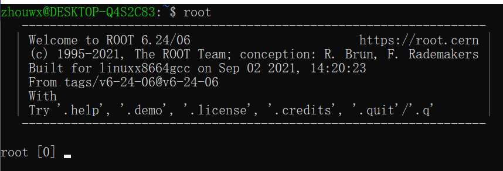

