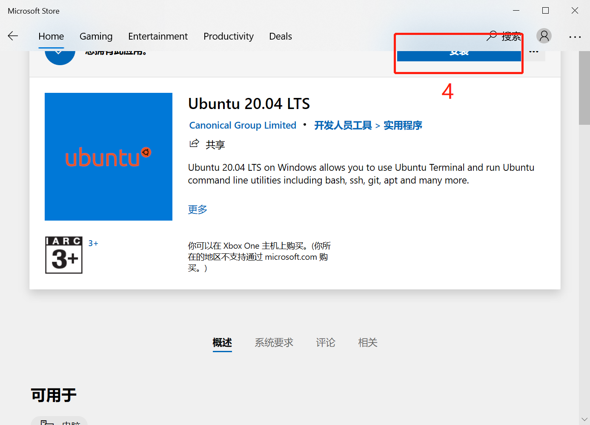

# Windows下linux子系统（ubuntu20）安装geant4教程

2021-11-06

## 一．在windows电脑安装ubuntu子系统
### 1. 设置windows电脑
点击电脑最左下角windows图标（开始菜单），点击设置，在查找设置处输入：开发者设置，点击进入，选择开发人员模式；再在查找设置处输入启用或关闭windows功能，选择适用于Linux的Windows子系统，点击确定；最后重启计算机。

### 2. 安装和设置ubuntu
#### 2.1 安装
重启电脑后，点击左下角微软商店搜索ubuntu，选择Ubuntu20.04 LTS并下载，下载完成后点击（鼠标左键）电脑最左下角windows图标（开始菜单），在最近添加里找到ubuntu，双击打开，设置用户名和密码（千万要记住密码）。
#### 2.2 更换为国内源。
打开ubuntu，依次输入命令：
sudo apt-get install vim 
