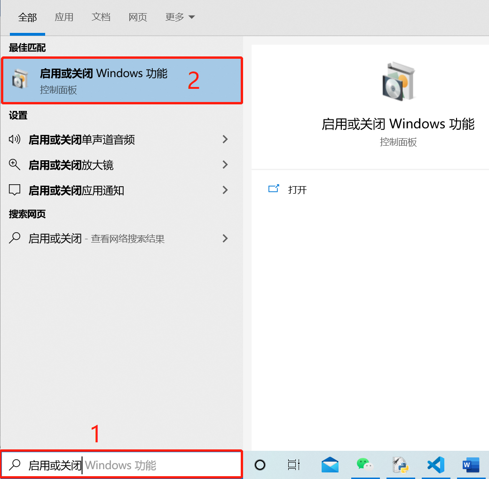

# Windows下linux子系统（ubuntu20）安装geant4教程

2021-11-06

## 一．在windows电脑安装ubuntu子系统
点击电脑最左下角windows图标（开始菜单），点击设置，在查找设置处输入：开发者设置，点击进入，选择开发人员模式；再在查找设置处输入启用或关闭windows功能，选择适用于Linux的Windows子系统，点击确定；最后重启计算机。

